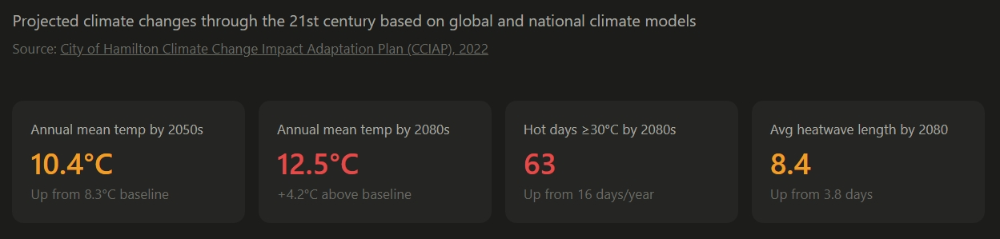
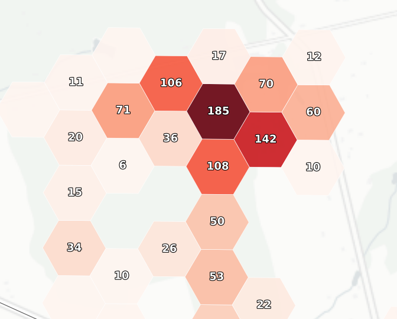
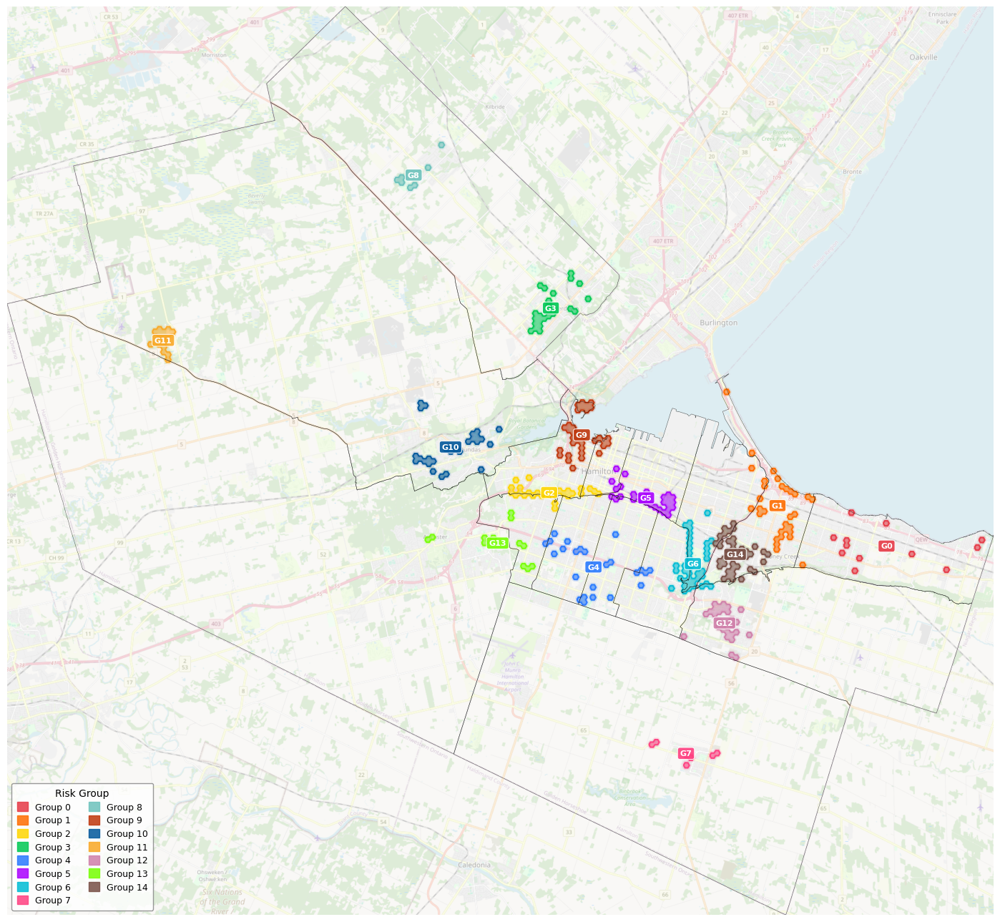
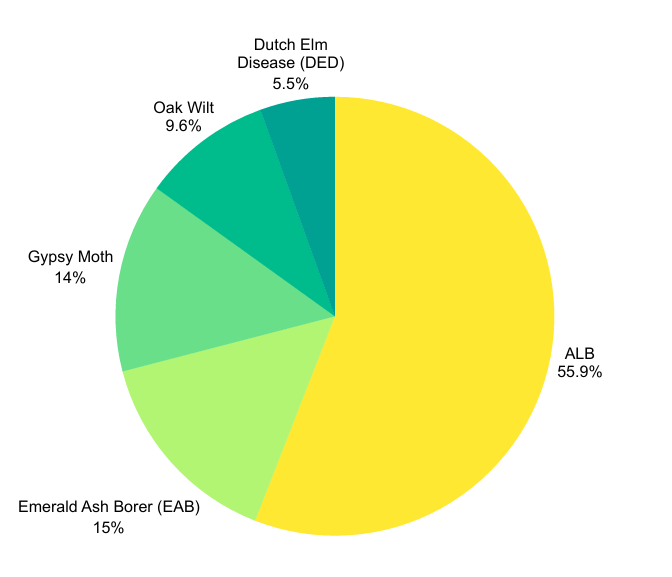

# 🌳 Mitigating Urban Canopy Loss: Quantifying Climate-Driven Risks and Prevention Strategies

> 🥇 **This Analysis won 1st Place — Presentation** &nbsp;|&nbsp; 🥉 **3rd Place Overall**


---

## 🏆 Competition Overview

|           |                                                         |
| --------- | ------------------------------------------------------- |
| **Event** | 2026 Higher Education Analytics Data Competition (HEAD) |
| **Host**  | Mohawk College — Hamilton, ON                           |
| **Date**  | March 19–20, 2026                                       |

### Problem Statement

> **Title: Understanding the Climate Change Impacts on the City's Tree Canopy**

This is a case study involving the analysis of the City of Hamilton's tree inventory, where students apply data analytics to understand climate change impacts on the City's urban forest.

The urban forest provides critical green infrastructure benefits: absorbing CO₂, reducing storm flooding, and providing shade to lower energy demands. At the same time, it is increasingly vulnerable to extreme weather, drought, intensified heat, and pest outbreaks.

### Key Questions Addressed

- What are the predominant climate risks facing the City's urban forest over the **short (2030), medium (2050), and long (2080) terms**?
- Which tree types and city areas are **most vulnerable** to climate change?
- How can the City use its tree inventory to **build a resilience framework** that supports the Urban Forest Strategy?

### Data Source

All core datasets were sourced from the **City of Hamilton's Open Data Portal**:  
🔗 [Hamilton Public Tree Inventory](https://open.hamilton.ca/datasets/SpatialSolutions::public-treeinventory/explore?showTable=true)

---

## 📋 Table of Contents

- [Competition Overview](#-competition-overview)
- [Background & Motivation](#-background--motivation)
- [Risk Scoring System](#-risk-scoring-system)
- [Cluster Analysis](#-cluster-analysis)
- [Key Findings](#-key-findings)
- [Recommendations](#-recommendations)
- [Methodology](#-methodology)
- [References](#-references)

---

## 🌍 Background & Motivation

Climate projections indicate Hamilton could experience **over 90 days above 30°C annually by 2075**, compared to roughly 15–20 days historically. Rising temperatures increase heat and drought stress in urban forests and accelerate the spread of invasive pests and tree diseases, creating new risks for long-term canopy stability.



Analysis of Hamilton's tree inventory highlights **three key vulnerability drivers**:

| Driver                  | Description                                                                                               |
| ----------------------- | --------------------------------------------------------------------------------------------------------- |
| **Tree Size (DBH)**     | Smaller trees are more sensitive to heat and drought stress                                               |
| **Species Composition** | Invasive species weaken ecological resilience                                                             |
| **Pest Susceptibility** | Warming conditions intensify pest outbreaks (EAB, Spongy Moth) and diseases (Oak Wilt, Dutch Elm Disease) |

Identifying where these pressures overlap is critical. This framework helps City of Hamilton urban forestry and Forestry & Horticulture teams **detect emerging risk zones** and **prioritize targeted interventions** before climate-driven canopy loss accelerates.

### Project Goals

1. Identify which areas of Hamilton's urban forest are most vulnerable to climate-related stressors, including pest pressure, invasive species, and low canopy diversity.
2. Map climate vulnerability across the city by grouping tree risk scores into hexagonal zones for easy ward-level comparison.
3. Support climate adaptation planning by identifying where canopy trees need protection and where species diversification is most urgent.
4. Help the city build long-term forest resilience by highlighting structurally young or pest-vulnerable zones that need early intervention.

---

## 🧮 Risk Scoring System

### General Formula

```
Tree Score      =  DBH Risk + Invasive Risk + Pest Exposure Rate

Hex Risk Score  =  Σ Tree Scores within cell
```

### How Tree Risk Scores Are Calculated

Each tree is assigned a composite score across three components:

| Component              | Weight    | Description                                                              |
| ---------------------- | --------- | ------------------------------------------------------------------------ |
| **DBH Risk**           | 0.5 – 1.0 | Based on diameter at breast height class (small, medium, large)          |
| **Invasive Risk**      | 0.0 – 1.0 | Whether the species is classified as invasive (e.g., Norway Maple = 1.0) |
| **Pest Exposure Rate** | 0.5 – 1.0 | Vulnerability to key urban pests (EAB, ALB, Spongy Moth, etc.)           |

### Example Tree Scores

| | | |
|:---:|:---:|:---:|
|  | **→** |  |

| Tree                    | DBH | INV | PEST | **Score** |
| ----------------------- | --- | --- | ---- | --------- |
| Norway Maple (Invasive) | 0.8 | 1.0 | 1.0  | **2.8**   |
| Sugar Maple (Native)    | 0.5 | 0.0 | 0.5  | **1.0**   |
| Ash Tree (EAB Risk)     | 1.0 | 0.0 | 0.5  | **1.5**   |

Individual scores are aggregated per hexagonal cell. Cells exceeding a **threshold of 150** are flagged for spatial clustering.

> **Example:** A hex cell containing the three trees above scores `2.8 + 1.0 + 1.5 = 187` → **HIGH RISK** ✅

### 🤖 Machine Learning — Agglomerative Clustering



**Agglomerative Clustering** is a bottom-up hierarchical clustering algorithm. Rather than requiring a predefined number of clusters upfront, it builds a tree of clusters (a _dendrogram_) by iteratively merging the closest data points or groups.

#### How It Works — Step by Step

```
1. Start: Each high-risk hex cell is its own cluster (N clusters)
        ↓
2. Compute pairwise distances between all clusters
        ↓
3. Merge the two closest clusters into one
        ↓
4. Recompute distances using Ward linkage
        ↓
5. Repeat steps 3–4 until K = 15 clusters remain
```

#### Why Ward Linkage?

Ward linkage merges clusters by **minimizing the total within-cluster variance** at each step — meaning it prefers merges that keep clusters as compact and internally consistent as possible.

| Linkage Method | Merge Criterion                         | Best For                            |
| -------------- | --------------------------------------- | ----------------------------------- |
| Single         | Minimum distance between any two points | Elongated shapes                    |
| Complete       | Maximum distance between any two points | Tight, spherical clusters           |
| Average        | Mean distance between all point pairs   | General use                         |
| **Ward** ✅    | **Minimize within-cluster variance**    | **Compact, balanced spatial zones** |

Ward linkage was selected because the goal was to produce **spatially contiguous, meaningful intervention zones** — groups of hex cells that are geographically close _and_ share similar risk profiles.

#### Input Features for Clustering

Each flagged hex cell (score > 150) was represented by:

| Feature                | Description                                   |
| ---------------------- | --------------------------------------------- |
| `latitude / longitude` | Spatial centroid of the hex cell (EPSG:26917) |
| `hex_risk_score`       | Total aggregated tree risk score for the cell |
| `pest_pressure_%`      | Share of high-pest-vulnerability trees        |
| `invasive_pressure_%`  | Share of invasive species trees               |
| `small_dbh_%`          | Share of small-diameter (immature) trees      |
| `large_dbh_%`          | Share of large-diameter (mature) trees        |

#### Choosing K = 15 Clusters

The number of clusters (K = 15) was determined by balancing two objectives:

- **Interpretability** — enough groups to distinguish meaningfully different risk profiles
- **Spatial granularity** — fine enough resolution for ward-level urban forestry planning

The resulting 15 clusters were then labeled as **Sensitive** or **Non-Sensitive** zones by cross-referencing Hamilton's Environmentally Sensitive Area (ESA) boundaries.

---

## 🗺️ Cluster Analysis


The city was divided into a **~260 m hexagonal grid** for spatial aggregation. High-risk cells (score > 150) were clustered into **15 priority intervention zones** using Agglomerative Clustering (Ward linkage).

### Risk Group Summary

| Risk Group | Zone Type     | Urgency Score | Pest Pressure | Invasive Pressure | Small DBH | Large DBH |
| ---------- | ------------- | ------------- | ------------- | ----------------- | --------- | --------- |
| **2**      | Sensitive     | **70**        | 59%           | 24%               | 11%       | 45%       |
| **14**     | Sensitive     | **69**        | 50%           | 20%               | 79%       | 45%       |
| **9**      | Sensitive     | **68**        | 34%           | 20%               | 42%       | 30%       |
| **6**      | Sensitive     | **65**        | 56%           | 8%                | 9%        | 41%       |
| **1**      | Sensitive     | 62            | 49%           | 18%               | 22%       | 40%       |
| **5**      | Sensitive     | 60            | 39%           | 23%               | 14%       | 47%       |
| **8**      | Sensitive     | 54            | 63%           | 12%               | 15%       | 43%       |
| **3**      | Non-Sensitive | 53            | 55%           | 21%               | 27%       | 33%       |
| **10**     | Non-Sensitive | 52            | 47%           | 21%               | 20%       | 41%       |
| **11**     | Sensitive     | 46            | 44%           | 50%               | 1%        | 36%       |
| **12**     | Non-Sensitive | 45            | 44%           | 17%               | 31%       | 30%       |
| **0**      | Non-Sensitive | 43            | 56%           | 20%               | 19%       | 31%       |
| **4**      | Non-Sensitive | 36            | 32%           | 11%               | 56%       | 19%       |
| **13**     | Non-Sensitive | 25            | 30%           | 7%                | 30%       | 30%       |
| **7**      | Non-Sensitive | 15            | 30%           | 1%                | 25%       | 34%       |

### Location Reference

| 🟠 Sensitive Zones                      | 🔵 Non-Sensitive Zones                      |
| --------------------------------------- | ------------------------------------------- |
| Group 1 — Van Wagner's Ponds            | Group 0 — Stoney Creek                      |
| Groups 2, 5 — Hamilton Escarpment       | Group 3 — Waterdown Neighbourhood           |
| Groups 6, 14 — Red Hill Creek           | Group 4 — Gilkson & Gourley Neighbourhood   |
| Group 8 — Carlisle North Forests        | Group 7 — Binbrook Neighbourhood            |
| Group 9 — Coote's Paradise              | Group 10 — Dundas Neighbourhood             |
| Group 11 — Hyde/Rockton/Beverly Complex | Group 12 — Upper Stoney Creek Neighbourhood |
|                                         | Group 13 — Meadowlands Neighbourhood        |

---

## 🔍 Key Findings

### Spatial Insights

- High-risk clusters (urgency score > 60) exhibit an **85% overlap with environmentally sensitive areas (ESA)** in Hamilton.
- The highest urgency scores are concentrated in environmentally sensitive areas where pest pressure, invasive species presence, and canopy structure interact.

### Pest Exposure Risk



The total tree inventory covers **281,657 trees**, mostly in urban areas. Pest exposure is distributed as follows:

| Pest                          | Share of Exposed Trees |
| ----------------------------- | ---------------------- |
| Asian Longhorned Beetle (ALB) | **55.9%**              |
| Emerald Ash Borer (EAB)       | 15%                    |
| Spongy Moth                   | 14%                    |
| Oak Wilt                      | 9.6%                   |
| Dutch Elm Disease (DED)       | 5.5%                   |

- ALB host trees (primarily maple species) represent **56% of pest-exposed trees in high-risk zones**, reflecting strong concentration that could enable rapid pest spread.
- Host trees occur in **spatially clustered zones** — outbreaks could propagate quickly through connected canopy patches.

### DBH Structure

- Risk clusters show large variation in canopy structure, with some zones dominated by immature trees (e.g., **Group 14: 79% small DBH**) while others contain substantial proportions of mature canopy (**30–47% large DBH**).
- This structural imbalance suggests that both young and mature canopy zones may face climate vulnerability — through reduced resilience in young trees or increased pest exposure in established host clusters.

### Dominant Stressors

Large tree diameter (large DBH) and higher vulnerability to pests are the **main risk factors** in the priority areas.

---

## ✅ Recommendations

### 🐛 Pest Monitoring & Early Detection

- **Prioritize Pest Monitoring in Host-Dense Clusters:** Focus surveillance efforts in maple-dominant areas where ALB host trees are concentrated, using risk map clusters to guide inspections and early detection.
- **Strengthen Early Detection Systems:** Deploy traps and monitoring stations in high-risk hexagonal cells identified by the risk scoring system to improve rapid detection of emerging infestations.
- **Reduce Host Concentration in Future Planting:** Avoid monoculture replanting in pest-prone zones and promote species diversity to limit future pest outbreak potential.

### 🌲 Structural Canopy Resilience

- **Protect Existing Large Canopy Trees:** Preserve mature trees that provide urban cooling, carbon storage, and ecological stability, especially within sensitive zones.
- **Promote Age-Balanced Urban Forest Structure:** Implement planting strategies that gradually balance young and mature tree populations, reducing long-term structural vulnerability.
- **Use Spatial Risk Mapping to Guide Urban Forestry Planning:** Integrate the risk scoring framework into planning decisions to help City of Hamilton urban forestry and Forestry & Horticulture teams prioritize monitoring, planting, and canopy management.

---

## 🔬 Methodology

### Data Preprocessing

- Tree classifications (DBH size, pest vulnerability genera, species invasiveness) were derived from **Hamilton's Urban Forest Strategy – Technical Report** to build the scoring system.
- Spatial data processing: coordinates were projected in **EPSG:26917** and **EPSG:3857** to ensure accurate distance and area calculations.
- Spatial risk analysis: the city was divided into a **~260 m hexagonal grid**, enabling consistent aggregation and comparison of tree risk scores across wards.

### Data Analysis

- Each tree was assigned a composite risk score based on DBH class, invasive species type, and pest vulnerability, then aggregated per hexagonal cell.
- Cells exceeding a **risk threshold of 150** were extracted and spatially clustered into 15 priority intervention zones using **Agglomerative Clustering (Ward linkage)**.

### Spatial Visualization & Reference Layers

| Tool                  | Purpose                               |
| --------------------- | ------------------------------------- |
| **GeoPandas**         | Spatial data processing and analysis  |
| **Contextily**        | Basemap tile integration              |
| **Matplotlib**        | Visualization and rendering           |
| **Esri WorldImagery** | Geographic basemap context            |
| Ward Boundaries       | Spatial interpretation and comparison |
| ESA Boundaries        | Sensitive area identification         |

> **Note:** Thresholds and classifications are derived from Hamilton's Urban Forest Strategy — Technical Report. Grid size can be adjusted based on spatial resolution needs.

---

## 📚 References

- City of Hamilton. (2023). _Ward boundaries_ [Dataset]. Hamilton Open Data. https://open.hamilton.ca/datasets/c2c6e4fbf4ca4dbca39446bf8892df38_7
- Ontario Invasive Plant Council. (n.d.). _Invasive plant species._ https://www.ontarioinvasiveplants.ca/invasive-plants/species/
- Ontario Ministry of Natural Resources and Forestry. (n.d.). _Tree atlas: Native trees of Ontario._ Government of Ontario. https://www.ontario.ca/page/tree-atlas#list-native-trees-ontario
- City of Hamilton. (2021). _Climate science report_ (Report CMO19008(b)/HSC19073(b)). ICLEI Canada.
- City of Hamilton. (2022). _Climate change impact and adaptation plan_ (Report CM22016). City of Hamilton.
- City of Hamilton. (2023). _Urban forest strategy technical report._ City of Hamilton.
- City of Hamilton. (2023). _Environmentally sensitive areas boundaries_ [Dataset]. Hamilton Open Data. https://open.hamilton.ca/datasets/27fb52cd87d347e09706d8990ba9a1c1_3

---

_This project was submitted to the HEAD Higher Education Analytics Data Competition at St. Clair College, hosted by Mohawk College (March 19–20, 2026)._
